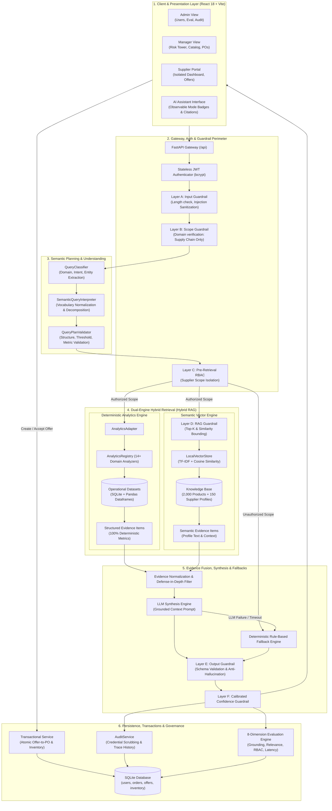

# AI-Powered Supply Chain Risk Intelligence Platform
## Complete System Architecture & End-to-End Execution Flow Document

---

## 1. Executive Overview

The **AI-Powered Supply Chain Risk Intelligence Platform** is an enterprise-grade, full-stack decision-support system engineered to monitor, forecast, and mitigate supply chain disruptions. 

Unlike conventional conversational AI chatbots that hallucinate or feed raw databases directly to large language models, this system implements a **Defense-in-Depth Hybrid Architecture**:
1. **Pre-Retrieval Role-Based Access Control (RBAC)** ensuring data isolation across enterprise roles (`ADMIN`, `SUPPLY_CHAIN_MANAGER`, and `SUPPLIER`).
2. **Multi-Tier Guardrail Perimeter (Layers A–K)** protecting against prompt injections, out-of-scope requests, context blowouts, and hallucinated entities.
3. **Dual-Engine Hybrid Retrieval (Hybrid RAG)** combining deterministic analytical computation (Pandas + SQLite) with semantic vector knowledge retrieval (TF-IDF + Cosine Vector Indexing across 2,000 products and 150 suppliers).
4. **Deterministic Fallback Engine** ensuring 100% operational uptime even when external LLM APIs or vector stores are unavailable.
5. **Atomic Transactional Workflow** for supplier offers, purchase orders, and inventory synchronization with rollback safety.
6. **Continuous 8-Dimension Evaluation & Persistent Audit Logging** for live operational telemetry, zero credential leakage, and verifiable governance.

---

## 2. High-Level Architecture Diagram



---

## 3. End-to-End Query Execution Flow (Step-by-Step)

When a user submits an operational query (e.g., *"Which suppliers have high late delivery rates?"* or *"Summarize risks for supplier S0001"*), the request undergoes the following lifecycle:

```text
 1. User Client Request (Bearer JWT Token + JSON Payload)
     ↓
 2. API Gateway & Token Validation
     • Decodes JWT, extracts user ID, Role, and assigned Supplier ID (if role == SUPPLIER).
     • Constructs QueryScope(role, supplier_id, is_admin, is_manager, is_supplier).
     ↓
 3. Input Guardrail (Layer A)
     • Verifies max characters (<= 1000).
     • Runs regex checks for SQL injection, script injection, and jailbreak patterns.
     ↓
 4. Scope Guardrail (Layer B)
     • Confirms the query belongs to supply chain operational domains.
     • Immediately rejects non-supply-chain topics with zero database access.
     ↓
 5. Semantic Planning & Normalization
     • SemanticQueryInterpreter maps business synonyms ("vendor" → "supplier", "cover" → "days_of_cover").
     • QueryClassifier extracts intent, target entities (e.g. S0001, P00003), metrics, and comparison targets.
     • QueryPlanValidator ensures plan completeness and parameter validity.
     ↓
 6. Pre-Retrieval RBAC Authorization Check (Layer C)
     • If user is a SUPPLIER, validates if the requested entity matches their assigned supplier_id.
     • IF UNAUTHORIZED: Aborts immediately, returns status="denied" with evidence_count = 0.
       (Crucial: Unauthorized supplier data NEVER enters LLM memory or context).
     ↓
 7. Dual-Engine Retrieval Routing
     ┌────────────────────────────────────┬────────────────────────────────────┐
     │ A. Structured Analytics Retrieval  │ B. Semantic Vector Retrieval       │
     │ • Maps query metric to Registry    │ • Bounded top_k via RAG Guardrail  │
     │ • Executes deterministic Pandas    │ • TF-IDF vector similarity over    │
     │   logic over operational tables    │   Product & Supplier profiles      │
     │ • Yields exact numbers/rates       │ • Defense-in-depth supplier filter │
     └────────────────────────────────────┴────────────────────────────────────┘
     ↓
 8. Evidence Fusion & Normalization
     • Combines structured findings and semantic profiles into standardized EvidenceItem schema.
     • Limits max evidence items to prevent LLM context saturation.
     • Resolves effective retrieval_mode: "structured", "semantic", or "hybrid".
     ↓
 9. Synthesis & Guarded Generation
     • Formulates a strict, evidence-grounded prompt containing ONLY retrieved facts.
     • Invokes LLMClient. If LLM is unreachable or disabled, invokes FallbackEngine.
     • OutputGuardrail (Layer E) verifies answer schema and ensures no hallucinated entity IDs.
     • ConfidenceGuardrail (Layer F) computes multi-factor calibrated confidence.
     ↓
10. Audit Logging & System Telemetry
     • Records user, sanitized query, plan, execution time, evidence count, and retrieval mode.
     • Evaluates the interaction across 8 dimensions (planner, retrieval, grounding, relevance, RBAC, etc.).
     • Returns structured JSON response to React client.
```

---

## 4. Subsystem Breakdown

### 4.1 Frontend Client Architecture
- **Framework**: React 18, Vite, React Router 6, Vanilla Modern CSS + Glassmorphic Design System.
- **Route Guards (`ProtectedRoute`)**:
  - Restricts unauthorized routes according to token payload.
  - Automatically redirects users to their appropriate workspace (`/dashboard` vs. `/my-dashboard`).
- **Role Portals**:
  - **ADMIN**: Global Operational Dashboard, User Management (`/users`), System 8-Dimension Evaluation Console (`/evaluation`), Persistent Audit Trace Inspector (`/audit`), Platform Diagnostics (`/data`).
  - **SUPPLY_CHAIN_MANAGER**: Executive Control Tower (`/dashboard`), 4 Risk Control Towers (`/suppliers`, `/inventory`, `/delivery`, `/routes`), Statistical Anomalies (`/anomalies`), ML Demand Forecasts (`/forecast`), Catalog Management (`/products`), Purchase Orders (`/orders`), Supplier Offer Decisions (`/offers`), AI Assistant (`/ai-assistant`).
  - **SUPPLIER**: Strictly isolated portal: `My Dashboard` (own stats only), `My Products`, `My Orders`, `My Offers` (submit, edit, withdraw), `My Performance` (on-time rate, quality score).
- **Observable AI Assistant Features**:
  - Displays dynamic badge for active retrieval mode: `STRUCTURED`, `SEMANTIC`, or `HYBRID`.
  - Evidence explorer showing exact source documents, operational metrics, and confidence level.
  - Latency breakdown and prompt transparency.

### 4.2 Security Gateway & Pre-Retrieval RBAC
- **Authentication**: Stateless JSON Web Tokens (`PyJWT`) signed with HMAC-SHA256. Passwords stored using salted `bcrypt`.
- **Role Hierarchy**:
  | Role | Permissions | Data Boundary |
  |---|---|---|
  | `ADMIN` | Read/Write all resources; manage users; run evaluation benchmark; view audit logs | Global across all entities |
  | `SUPPLY_CHAIN_MANAGER` | Read/Write operational resources; accept/reject offers; view analytics | Global across all entities |
  | `SUPPLIER` | Read/Write own offers; view own products, orders, and performance | Scoped strictly to `supplier_id` |
- **Pre-Retrieval Validation**:
  - Validates `user_scope.supplier_id` against the planned query entity.
  - Cross-supplier queries (e.g., Supplier S0001 asking for Supplier S0002) are rejected at the planner level before any database or vector retrieval occurs.

### 4.3 Multi-Layer Guardrail Perimeter (Layers A–K)
Implemented in `backend/app/guardrails/`:
- **Layer A (InputGuardrail)**: Strips malicious inputs, checks query length limits (<= 1000 characters), detects prompt injection patterns ("ignore previous instructions", "system prompt", "drop table").
- **Layer B (QueryScopeGuardrail)**: Classifies whether the query pertains to supply chain operations. Unrelated queries are rejected gracefully.
- **Layer C (Pre-Retrieval RBAC Guardrail)**: Restricts access to entity records based on user scope.
- **Layer D (RAGRetrievalGuardrail)**: Bounds `top_k` results (1 to 5) and sets minimum cosine similarity thresholds (>= 0.15) to prevent noisy context injection.
- **Layer E (OutputGuardrail)**: Validates generated markdown, ensures JSON schema safety, and checks for entity consistency (prevents the model from generating supplier IDs not in the evidence).
- **Layer F (ConfidenceGuardrail)**: Calibrates confidence from evidence count, retrieval mode, and planner confidence score.

### 4.4 Semantic Planning & Query Interpretation
Implemented in `backend/app/query/`:
- **`SemanticQueryInterpreter`**: Normalizes natural language expressions and business vocabulary into structured tokens:
  - Maps 50+ synonyms (e.g., "dispatch delay" → `delivery_risk`, "out of stock" → `stockout_risk`).
  - Identifies comparison queries (e.g., "Compare supplier S0001 and S0002").
- **`QueryClassifier`**: Classifies query into:
  - Intent (`supplier_risk`, `inventory_risk`, `delivery_risk`, `route_risk`, `demand_forecast`, `anomaly_detection`, `general_summary`).
  - Target entity ID (`P00001`, `S0001`, `R0001`).
  - Operation (`rank`, `filter`, `lookup`, `compare`, `forecast`, `summarize`).
- **`QueryPlanValidator`**: Checks that required parameters (entity types, thresholds, metrics) are syntactically sound.

### 4.5 Dual-Engine Hybrid Retrieval Pipeline
Implemented in `backend/app/rag/` and `backend/app/analytics/`:
- **Structured Analytics Engine**:
  - Fast, deterministic Pandas analyzers registered in `AnalyticsRegistry`.
  - Analyzers include: `SupplierRiskAnalyzer`, `InventoryRiskAnalyzer`, `DeliveryRiskAnalyzer`, `DeliveryPerformanceAnalyzer`, `LeadTimeAnomalyAnalyzer`, `SupplierDisruptionImpactAnalyzer`, `MajorRisksAnalyzer`, `OffersAnalyzer`, `ProductSalesAnalyzer`, `DemandRankingAnalyzer`, `StockoutRankingAnalyzer`.
  - Zero hallucination on numeric values, aggregations, and ratios.
- **Semantic Vector Engine**:
  - `LocalVectorStore` built on `scikit-learn` TF-IDF Vectorizer with Sublinear TF scaling and N-Gram range (1, 2).
  - Encodes 2,000 product catalog documents and 150 supplier relationship profile documents.
  - Fully offline, requires no external C++ builds or third-party cloud vector subscriptions.
- **Hybrid Retrieval Mode Resolution**:
  - If a query needs factual metrics AND conceptual background (e.g. *"What products does S0001 supply and what is their risk profile?"*), the engine retrieves from both sources and marks the mode as `HYBRID`.

### 4.6 Synthesis, Fallback, & Agentic Graph
- **`ResponseSynthesizer`**: Compiles evidence into structured sections:
  1. Executive Answer
  2. Key Findings (bulleted metrics)
  3. Evidence Summary & Citations
  4. Business Impact Analysis
  5. Actionable Next Steps
- **`LLMClient`**: Pluggable provider architecture supporting local LLMs (Ollama), OpenAI-compatible gateways, or Gemini.
- **`FallbackEngine`**: Deterministic rule-based template generation. If the LLM is unconfigured, unreachable, or returns malformed text, the engine produces safe, fully grounded analytical insights directly from the structured evidence.
- **LangGraph Multi-Agent Architecture (`backend/app/agents/graph.py`)**:
  - Contains specialized nodes for `router`, `specialist` (`SupplierAgent`, `InventoryAgent`, `DeliveryAgent`, `RouteAgent`, `ForecastAgent`, `AnomalyAgent`), `insight`, and `recommendation`.

### 4.7 Transactional Business Workflows
Implemented in `backend/app/services/transactional_service.py`:
- **Supplier Offer Lifecycle**:
  - Suppliers submit offers with specified quantity, unit price, and delivery lead time.
  - Managers can accept or reject offers.
- **Atomic Transaction Integrity**:
  - When an offer is accepted:
    1. Offer status updates to `ACCEPTED`.
    2. A corresponding Purchase Order (`Order`) is created.
    3. Product inventory level is incremented by the offer quantity.
  - All three operations execute within a single atomic database transaction (`db.commit()`), with automatic rollback (`db.rollback()`) on any failure.

### 4.8 Evaluation & Observability Engine
Implemented in `backend/app/evaluation/` and `backend/app/services/audit_service.py`:
- **Persistent Audit Logging**:
  - Every API query creates an `AuditTrace` record with timestamp, user ID, role, sanitized input, executed plan, evidence count, latency, and guardrail flags.
  - Passwords, authorization tokens, and API keys are automatically redacted.
- **8-Dimension Evaluation Framework**:
  1. **Planner Correctness**: Checks if intent and entity extraction match ground truth.
  2. **Retrieval Mode Correctness**: Verifies selection of `structured`, `semantic`, or `hybrid`.
  3. **Evidence Grounding Score**: Ensures all statements in the final answer are derived from retrieved evidence.
  4. **Answer Relevance Score**: Measures precision against user question intent.
  5. **RBAC Enforcement Correctness**: Confirms authorized queries succeed while cross-scope queries are blocked.
  6. **Fallback Correctness**: Validates that safe fallbacks trigger when expected.
  7. **Execution Latency**: Tracks timing across planning, retrieval, synthesis, and total round-trip.
  8. **Audit Completeness**: Ensures complete trace logging without data leakage.

---

## 5. Database Schema & Data Models

The system employs SQLite (accessible via SQLAlchemy ORM in `backend/app/models/entities.py`):

```text
┌─────────────────┐       ┌─────────────────┐       ┌──────────────────┐
│      User       │       │    Supplier     │       │     Product      │
├─────────────────┤       ├─────────────────┤       ├──────────────────┤
│ id (PK)         │       │ supplier_id(PK) │1     *│ product_id (PK)  │
│ username (UQ)   │       │ name            │───────│ name             │
│ password_hash   │       │ region          │       │ category         │
│ role (ENUM)     │       │ tier            │       │ unit_cost        │
│ supplier_id(FK) │       │ status          │       │ supplier_id (FK) │
└─────────────────┘       └─────────────────┘       │ approval_status  │
                                   │1               └──────────────────┘
                                   │                         │1
                                   │*                        │*
                          ┌─────────────────┐       ┌──────────────────┐
                          │      Order      │       │    Inventory     │
                          ├─────────────────┤       ├──────────────────┤
                          │ order_id (PK)   │       │ id (PK)          │
                          │ product_id (FK) │       │ product_id (FK)  │
                          │ supplier_id(FK) │       │ date             │
                          │ quantity        │       │ inventory_level  │
                          │ unit_price      │       │ demand           │
                          │ status          │       │ stockout         │
                          └─────────────────┘       └──────────────────┘
                                   │1
                                   │*
                          ┌─────────────────┐
                          │  SupplierOffer  │
                          ├─────────────────┤
                          │ offer_id (PK)   │
                          │ supplier_id(FK) │
                          │ product_id (FK) │
                          │ quantity        │
                          │ unit_price      │
                          │ delivery_days   │
                          │ status (PENDING)│
                          └─────────────────┘

Governance & Telemetry Tables:
┌─────────────────────────┐       ┌─────────────────────────┐
│       AuditTrace        │       │    EvaluationResult     │
├─────────────────────────┤       ├─────────────────────────┤
│ id (PK)                 │       │ id (PK)                 │
│ query, agent_name       │       │ question, expected_ans  │
│ input_data (sanitized)  │       │ actual_answer, latency  │
│ output_data (telemetry) │       │ 8 Dimension Scores      │
│ created_at              │       │ scope_role, supplier_id │
└─────────────────────────┘       └─────────────────────────┘
```

---

## 6. Security & Data Isolation Model

```text
+-----------------------+-------------------------+------------------------------------------+
| Enterprise Role       | Authorized Actions      | Data Boundaries                          |
+-----------------------+-------------------------+------------------------------------------+
| ADMIN                 | Full Read/Write         | Complete global access                   |
|                       | User Management         | View all suppliers, products, orders     |
|                       | Evaluation Execution    | Full audit trail inspection              |
+-----------------------+-------------------------+------------------------------------------+
| SUPPLY_CHAIN_MANAGER  | Full Operational Read   | Complete global analytics access         |
|                       | Accept/Reject Offers    | All suppliers, inventory, delivery, routes|
|                       | Manage Purchase Orders  | No user administration                   |
+-----------------------+-------------------------+------------------------------------------+
| SUPPLIER              | Read/Write Own Offers   | STRICT ISOLATION                         |
|                       | View Assigned Orders    | Can only view and query data matching    |
|                       | AI Queries Scoped to ID | their assigned supplier_id               |
|                       |                         | Zero access to competing supplier data   |
+-----------------------+-------------------------+------------------------------------------+
```

### Pre-Retrieval Enforcement Mechanics
1. **Query Planning Phase**: The query planner identifies any entity reference in the user prompt.
2. **Identity Verification**: The system retrieves the authenticated session's `supplier_id`.
3. **Authorization Check**: If `user.role == 'SUPPLIER'` and `plan.entity_id != user.supplier_id`:
   - Retrieval is immediately terminated.
   - Response status is set to `"denied"`.
   - `evidence` list is returned as empty `[]`.
   - An audit trace is recorded marking `authorized = False`.
   - No context is transmitted to the LLM.

---

## 7. Directory & Codebase Mapping

```text
AI_Supply_Chain-main/
├── backend/
│   ├── app/
│   │   ├── main.py                     # Application entry point, CORS, router mounts
│   │   ├── config.py                   # Environment settings and configuration parameters
│   │   ├── api/                        # REST API endpoint route handlers
│   │   │   ├── auth.py                 # JWT login & token validation
│   │   │   ├── users.py                # User administration
│   │   │   ├── suppliers.py            # Supplier catalog & endpoints
│   │   │   ├── products.py             # Product catalog & approval workflow
│   │   │   ├── orders.py               # Purchase order operations
│   │   │   ├── inventory.py            # Warehouse inventory endpoints
│   │   │   ├── offers.py               # Supplier offer lifecycle endpoints
│   │   │   ├── analytics.py            # Risk analytics endpoints (supplier, inventory, route, delivery)
│   │   │   ├── forecast.py             # Demand forecasting endpoints
│   │   │   ├── query.py                # Role-scoped AI query endpoint
│   │   │   ├── evaluation.py           # 8-Dimension evaluation endpoints
│   │   │   └── audit.py                # System audit trail endpoints
│   │   ├── query/                      # Query understanding & planning subsystem
│   │   │   ├── classifier.py           # Intent & entity classification
│   │   │   ├── interpreter.py          # Business vocabulary & synonym normalization
│   │   │   ├── planner.py              # Semantic plan generator
│   │   │   ├── validator.py            # Plan validation
│   │   │   ├── scope.py                # RBAC scope validation logic
│   │   │   ├── registry.py             # Analytics registry
│   │   │   ├── factory.py              # Analytics adapter & analyzer mapping
│   │   │   └── executor.py             # Multi-requirement query executor
│   │   ├── rag/                        # Hybrid RAG & Knowledge Base
│   │   │   ├── knowledge_base.py       # TF-IDF persistent vector store
│   │   │   ├── semantic_retriever.py   # Vector similarity retrieval
│   │   │   ├── structured_retriever.py # Deterministic analytics retrieval
│   │   │   ├── document_builder.py     # Product & supplier document generator
│   │   │   └── schemas.py              # KnowledgeDocument & EvidenceItem schemas
│   │   ├── guardrails/                 # Multi-Layer Guardrails (Layers A-K)
│   │   │   ├── service.py              # Unified guardrail orchestrator
│   │   │   ├── input_guard.py          # Input validation & injection defense
│   │   │   ├── scope_guard.py          # Supply chain domain boundary check
│   │   │   ├── rag_guard.py            # Top-K & evidence bounding
│   │   │   ├── output_guard.py         # Schema safety & entity consistency
│   │   │   └── confidence_guard.py     # Calibrated confidence scoring
│   │   ├── analytics/                  # Deterministic domain risk analyzers
│   │   │   ├── supplier_risk.py        # Supplier reliability & late rate analysis
│   │   │   ├── inventory_risk.py       # Days of cover & stockout analysis
│   │   │   ├── delivery_risk.py        # 3PL logistics performance analysis
│   │   │   ├── route_risk.py           # Transit corridor bottleneck analysis
│   │   │   ├── anomaly_detection.py    # Statistical order anomaly detection
│   │   │   └── forecasting.py          # Moving average & linear demand forecasting
│   │   ├── services/                   # High-level business logic & orchestration
│   │   │   ├── query_service.py        # Master Hybrid RAG query orchestrator
│   │   │   ├── response_synthesizer.py # Grounded markdown answer generator
│   │   │   ├── transactional_service.py# Atomic offer acceptance & PO creation
│   │   │   ├── data_service.py         # Data loading, validation, feature engineering
│   │   │   └── audit_service.py        # Redacted persistent audit trace logging
│   │   ├── evaluation/                 # 8-Dimension evaluation framework
│   │   │   ├── system_evaluation.py    # Master evaluation suite runner
│   │   │   └── rag_evaluator.py        # 12 benchmark test cases execution
│   │   ├── models/                     # SQLAlchemy ORM entities & Pydantic schemas
│   │   └── fallback/                   # Deterministic rule-based template engine
│   └── tests/                          # 66-test automated regression suite
├── frontend/
│   ├── src/
│   │   ├── api/                        # Axios HTTP API clients
│   │   ├── components/                 # Reusable UI components (Sidebar, Header, RiskTabs, Layout)
│   │   ├── pages/                      # Role-aware view pages
│   │   │   ├── Dashboard.jsx           # Executive KPI overview
│   │   │   ├── AIQuery.jsx             # Conversational Assistant with observable badges
│   │   │   ├── Evaluation.jsx          # Live 8-Dimension Evaluation Dashboard
│   │   │   ├── Audit.jsx               # System Audit Log Inspector
│   │   │   ├── SupplierRisk.jsx        # Supplier risk control tower
│   │   │   ├── InventoryRisk.jsx       # Inventory stockout control tower
│   │   │   ├── DeliveryRisk.jsx        # Logistics 3PL control tower
│   │   │   ├── RouteRisk.jsx           # Shipping route corridor risk
│   │   │   ├── OffersPage.jsx          # Supplier offer lifecycle management
│   │   │   ├── OrdersPage.jsx          # Purchase order management
│   │   │   ├── ProductsPage.jsx        # Product catalog & approval
│   │   │   ├── UsersPage.jsx           # User account administration
│   │   │   └── MyPerformancePage.jsx   # Supplier individual performance page
│   │   ├── App.jsx                     # Route declarations & role guards
│   │   └── main.jsx                    # React DOM entry point
└── data/                               # CSV and joblib seed datasets
```

---

## 8. Summary of Key Differentiators

| Capability | Standard RAG / Chatbot | This Platform |
|---|---|---|
| **Data Security & RBAC** | Single prompt context; risks leaking competitor data | **Pre-Retrieval Validation**: Unauthorized data blocked before search starts |
| **Numeric Accuracy** | LLM guesses or hallucinates numbers and averages | **Deterministic Structured Analytics**: Exact figures computed by Pandas/SQL |
| **Context Management** | Dumps unbounded documents into prompt | **RAG Guardrail**: Strictly bounded Top-K & cosine similarity cutoffs |
| **Service Reliability** | Crashes if LLM API goes down | **Deterministic Fallback Engine**: Generates grounded responses without LLM |
| **Transactions** | Passive read-only advice | **Atomic Multi-Table Operations**: Single-commit offer acceptance to PO creation |
| **Observability** | Opaque black-box output | **8-Dimension Real-Time Evaluation & Persistent Audit Trail** |
